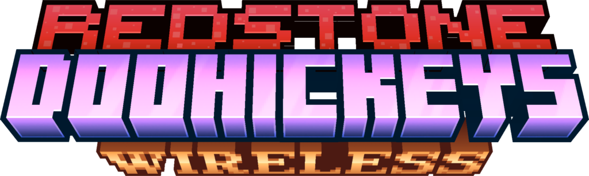
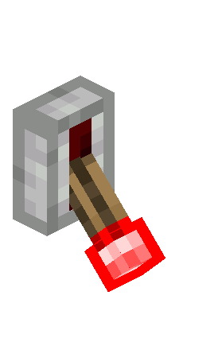
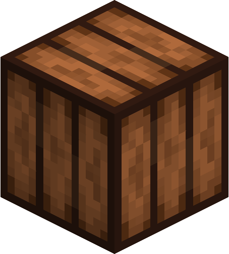
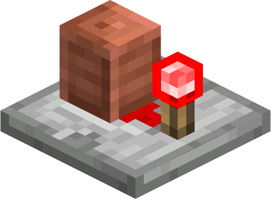

Redstone Doohickeys is a small addon that adds a couple of redstone utilities to the game

## Redstone Link

 - Redstone Links are essencially a copy of the behavior from the Create mod, minus the items being visible
 - Their behavior should be explained in the gif above
 - Remember: When sneak-interacting, only an empty hand will work

## Graduated Lever

 - The graduated lever can dynamically be set to any redstone strength value 0-15
 - Interact to bring the strength up, Sneak-interact to bring the strength down
 - Remember: When sneak-interacting, only an empty hand will work

## Dimmable Redstone Lamp

 - Dimmable Redstone Lamps will match their light level to the strength of redstone they recieve

## Redstone Capacitor

 - The Capacitor acts similaraly to a real-life capacitor
 - It will output the signal strength it recieves from behind when powered, it will then charge up the copper "battery" slowly to the aforementioned strength
 - When the behind signal strength drops or is removed completely, the capacitor will continue to output at the charge it was set to, but will slowly drop down to the new signal strength
